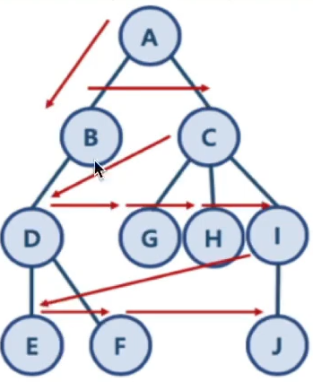

# 너비 우선 탐색 (Breadth-First Search)

## BFS와 DFS란

- 대표적인 그래프 탐색 알고리즘
  - 너비 우선 탐색 (Breadth-First Search) : 정점들과 같은 레벨에 있는 노드들(형제 노드들)을 먼저 탐색하는 방식
  - 깊이 우선 탐색 (Depth-First-Search) : 정점의 자식들을 먼저 탐색하는 방식
- BFS 구현해 보기
  - 아래 예시에 대한 구현
  - 
  - Visited와 NeedVisit 두 개의 Queue를 이용해 구현
  - Queue의 특성상, 왼쪽 Node들부터 first-in, first-out으로 나오게 된다.
```java
public class BFSSearch {
  public static void main(String[] args) {
    HashMap<String, ArrayList<String>> graph = new HashMap<>();
    // 1. 트리 형태의 데이터 만들기
    graph.put("A", new ArrayList<String>(Arrays.asList("B", "C")));
    graph.put("B", new ArrayList<String>(Arrays.asList("A", "D")));
    graph.put("C", new ArrayList<String>(Arrays.asList("A", "G", "H", "I")));
    graph.put("D", new ArrayList<String>(Arrays.asList("B", "E", "F")));
    graph.put("E", new ArrayList<String>(Arrays.asList("D")));
    graph.put("F", new ArrayList<String>(Arrays.asList("D")));
    graph.put("G", new ArrayList<String>(Arrays.asList("C")));
    graph.put("H", new ArrayList<String>(Arrays.asList("C")));
    graph.put("I", new ArrayList<String>(Arrays.asList("C", "J")));
    graph.put("J", new ArrayList<String>(Arrays.asList("I")));
    // 트리에 대해 BFS 수행하기
    System.out.println(bfsFunc(graph, "A"));
  }

  public static ArrayList<String> bfsFunc(HashMap<String, ArrayList<String>> graph, String startNode) {
    ArrayList<String> visited = new ArrayList<>(); // 방문한 노드, 즉 탐색을 수행한 노드가 저장된 Queue
    ArrayList<String> needVisit = new ArrayList<>();//방문한 노드와 연결되어 있던 노드로 이제 순서대로 방문해야 하는 노드
    needVisit.add(startNode); // 일단 시작 노드를 넣는다. 방문해야 하는 노드로 넣는다.
    // 더 이상 방문해야 하는 노드가 없을 때까지 반복, 처음에는 startNode가 있다.
    while (!needVisit.isEmpty()) {
      // 가장 앞에 있는 노드를 꺼낸다.
      String node = needVisit.remove(0);
      // 꺼낸 노드가 추가로 방문해야 하는 노드, 즉 자식 노드들을 갖고 있다면
      // 이들을 needVisit 큐에 등록한다.
      if (!visited.contains(node)) {
        // 일단 꺼낸 노드는 방문한 것이므로 방문큐에 넣는다.
        visited.add(node);
        // 꺼낸 노드의 자식 노드들을 방문 대기 큐에 넣는다.
        // 같은 depth의 노드들이 왼쪽부터 순서대로 삽입되게 된다.
        needVisit.addAll(graph.get(node));
      }
    }
    return visited;
  }
}

```
## 시간 복잡도 - O(V + E) / O(N^2)
  - 노드 수 : V
  - 간선 수 : E
    - 위 방식은 인접 리스트 방식의 구현으로, while needVisit은 V + E번 만큼 반복
    - 따라서 시간 복잡도는 O(V + E) -> 모든 노드와 간선을 한 번씩 방문하는 데 걸리는 시간
    - 인접 행렬 방식으로 구현 시 O(V^2) 가 된다.