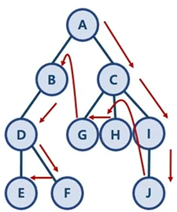

# 깊이 우선 탐색 (Depth-First Search)

## BFS와 DFS란

- 대표적인 그래프 탐색 알고리즘
    - 너비 우선 탐색 (Breadth-First Search) : 정점들과 같은 레벨에 있는 노드들(형제 노드들)을 먼저 탐색하는 방식
    - 깊이 우선 탐색 (Depth-First-Search) : 정점의 자식들을 먼저 탐색하는 방식
- DFS 구현해 보기
    - BFS와 같은 트리 구조에 대한 구현
    - 
    - BFS가 visited와 needVisit 두 개의 Queue를 활용한 반면
    - DFS는 하나의 Stack과 하나의 Queue를 활용한다는 차이가 있다.
    - Stack의 특성상, 왼쪽 Node들부터 first-in, 오른쪽 Node들부터 first-out으로 나오게 된다.

```java
public class DFSSearch {
    public static void main(String[] args) {
        HashMap<String, ArrayList<String>> graph = new HashMap<>();
        // 1. 트리 형태의 데이터 만들기
        graph.put("A", new ArrayList<String>(Arrays.asList("B", "C")));
        graph.put("B", new ArrayList<String>(Arrays.asList("A", "D")));
        graph.put("C", new ArrayList<String>(Arrays.asList("A", "G", "H", "I")));
        graph.put("D", new ArrayList<String>(Arrays.asList("B", "E", "F")));
        graph.put("E", new ArrayList<String>(Arrays.asList("D")));
        graph.put("F", new ArrayList<String>(Arrays.asList("D")));
        graph.put("G", new ArrayList<String>(Arrays.asList("C")));
        graph.put("H", new ArrayList<String>(Arrays.asList("C")));
        graph.put("I", new ArrayList<String>(Arrays.asList("C", "J")));
        graph.put("J", new ArrayList<String>(Arrays.asList("I")));
        // 트리에 대해 BFS 수행하기
        System.out.println(dfsFunc(graph, "A"));
    }

    public static ArrayList<String> dfsFunc(HashMap<String, ArrayList<String>> graph, String startNode) {
        // 방문한 노드를 저장할 리스트, 원래는 Queue다
        ArrayList<String> visited = new ArrayList<>();
        // 방문예정인 노드를 저장할 리스트, 원래는 Stack이다.
        ArrayList<String> needVisit = new ArrayList<>();
        // 첫 노드 삽입
        needVisit.add(startNode);
        while(!needVisit.isEmpty()) {
            // needVisit은 스택이므로, last-in인 요소를 first-out 해 준다.
            // BFS와 다른점은 여기밖에 없다. Queue가 아닌 Stack이 되었다는 점
            String node = needVisit.remove(needVisit.size() - 1);
            // 꺼낸 노드가 방문한 적 없는 노드라면
            if (!visited.contains(node)) {
                // 방문처리
                visited.add(node);
                // 해당 노드의 자식들을 stack에 넣기
                // 같은 depth의 다른 노드들보다 해당 노드의 자식들이 나중에 들어오게 된 상황
                // last-out이므로 자식들이 먼저, 그 중에서도 오른쪽 자식들이 먼저 탐색되게 된다.
                needVisit.addAll(graph.get(node));
            }
        }
        return visited;
    }
}
```
## 시간 복잡도 - O(V + E) / O(N^2)
- BFS와 완전히 동일
- 노드 수 : V
- 간선 수 : E
    - 위 방식은 인접 리스트 방식의 구현으로, while needVisit은 V + E번 만큼 반복
    - 따라서 시간 복잡도는 O(V + E) -> 모든 노드와 간선을 한 번씩 방문하는 데 걸리는 시간
    - 인접 행렬 방식으로 구현 시 O(V^2) 가 된다.