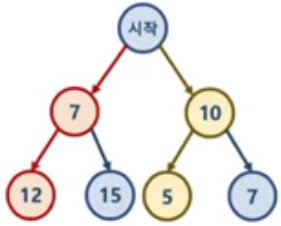

# 탐욕 알고리즘 이해

## 1. 탐욕 알고리즘이란

- 최적의 해에 가까운 값을 구하기 위해 사용된다
- 여러 경우 중 하나를 결정해야 할 때마다, 매순간 최적이라고 생각되는  경우를 선택하는 방식으로 진행해 최종 값을 구하는 방식

## 2. 탐욕 알고리즘 예시

어렵지 않은 문제들이지만 그리디 알고리즘의 가장 대표적인 문제들

### 문제 1: 동전 문제
- 지불해야 하는 값이 4720원일 때 1원 50원 100원 500원 동전으로 동전의 수가 가장 적게 지불하는 문제기 데펴작

### 문제 2 : 부분 배낭 문제 (Fractional Knapsack Problem)
- 무게 제한이 k인 배낭에 최대 가치를 가지도록 물건을 넣는 문제
	- 각 물건은 무게 (w)와 가치(v)로 표현
	- 물건은 쪼갤 수 있다는 가정이므로 물건의 일부분이 배낭에 넣어질 수 있다.
	- 물건을 쪼갤 수 없다는 가정이면  0/1 Knapsack Probelm으로 불린다.
	
## 탐욕 알고리즘 한계
- 탐욕 알고리즘은 근사치 추정에 보통 활용된다.
- 반드시 최적해를 구하는 게 아니기 때문
- 최적해에 가까운 값을 구하는 방법 중 하나

### 최적해를 구하지 못하는 예시

- 시작 노드에서 시작해서 가장 작은 값을 찾아 leaf node까지 가는 경로를 찾는 과정
	- greedy 알고리즘 적용 -> 7 -> 12 이므로 19가 답으로 나온다.
	- 하지만 실제 가장 작은 값은 10 -> 5 이므로 15가 답